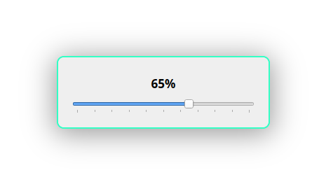

## Brightness Slider
>Simple brightness slider for external monitors sitting in the tray.

### Usage

Click tray icon and adjust with mousewheel, touchpad scroll, arrow keys (5%), PageUp/Down (20%) or
by presets in the icon's right click menu.
Closes after 2 seconds or with Esc.

### Dependencies

`python3-pyqt6`, `ddcutil`; the module `i2c-dev` may need to be loaded if the `/dev/i2c-*` devices do not exist.

### Installation

* Copy `brightness-slider` somewhere in your `$PATH` and make sure it's executable.
* Copy `brightness-slider.desktop` to `~/.local/share/applications`.
